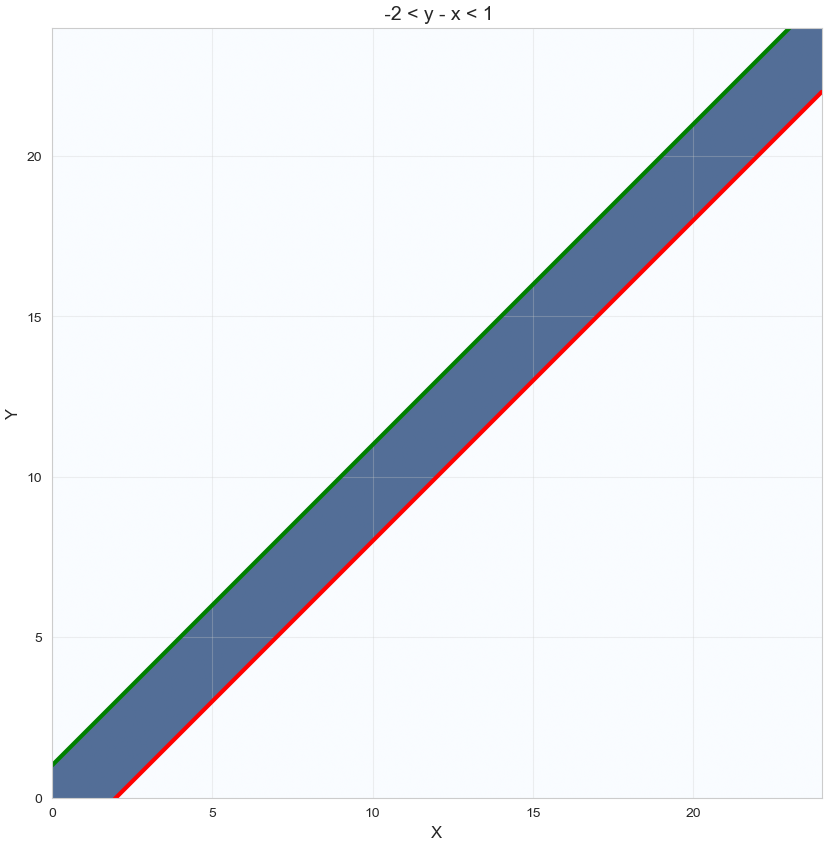

# 1 Лабораторная работа
### Федоров Александр
## 1.1 ВП и формула Байесса
### Задание 1 - Определить с обоснованием зависимость или независимость
#### 1.a) Несовместные события
$P(A\cup B)= P(A) + P(B) - P(A\cap B)$. \
Для несовместных событий 
$P(A\cap B)=0$ - определение.\
$P(A \cap B)= P(A)P(B)$ - определение независимости\
Несовместные события не могут быть независимыми, кроме случаев, когда есть тривиальные события
#### 1.б) События, образующие $\sigma$ алгебру $\Sigma$ в пространстве $( \Omega, \Sigma,  \mathbb P) $
$\sigma$ алгебра это набор все подмножеств (комбинаций событий) в множестве исходов. 
1. $\emptyset \in \Sigma$ и $\Omega \in \Sigma$
2. Замкнутость относительно перехода к дополнению
3. Замкнутость относительно объединения и пересечения множеств.\
Случайные события из $\Omega$ входят в $\Sigma$. Если события несовместны, зависимы, если совместны, то
возможны 2 варианта. Зависит от алгебры и от $\mathbb P$

#### 1.в) События, имеющие одинаковую вероятность
Ну тут просто может быть как угодно, значение вероятности не дает никаких данных 

### Задание 2 - Симметричные монеты, надо определить события, равносильные (события или наступают вместе или не наступает ни одно из них)
- A — {OO, OP};
- B — {PO,  PP};
- C — {OO, PO};
- D — {OP, PP};
- E — {OO, PO, OP};
- F — {PP, PO, OP};
- G — {PO, OP};
- H — {PP};
- K — {OO}.
#### 2а) $A+C$=$E$
#### 2.b)$A \cap C = K$
#### 2.c)$E \cap F = G$
#### 2.d)$G \cup E = E$
#### 2.e)$G \cap E = G$
#### 2.f)$B \cap D  = H$
#### 2.g)$E \cup K = E$
### Задание 3
Производится выстрел по вращающейся круговой мишени, в которой закрашены два непересекающихся сектора с углом 20$^o$. Какова вероятность попадания в закрашенную область?\
Общий сектор - 40$^o$ $\Rightarrow$ вероятность P$=\frac{40}{360}=\frac{1}{9}$
### Задание 4
Два парохода должны подойти к одному и тому же причалу независимо друг от друга и равновозможно в течение суток. Определить вероятность того, что одному из них придется ожидать освобождения причала,
если время стоянки первого парохода — 1 час, а второго — 2 часа.\
Обозначим время прихода пароходов как $x$ и $y$. 
$$  
\begin{cases}  
y - x <1,  \\  
x-y<2,  
\end{cases}  \Rightarrow -2 < y-x <1
$$

Закрашенная площадь -  $576 - 22 \times 22 \times \frac{1}{2} - 23 \times 23 \times \frac{1}{2} = 69.5$\
Искомая вероятность - $\frac{69.5}{576}$

### Задание 5
Самолет, по которому ведется стрельба, состоит из трех различных по
уязвимости частей:\
(a) Кабина летчика и двигатель\
(b) Топливные баки\
(c) Планер\
Для поражения самолета достаточно либо одного попадания в первую
часть, либо двух попаданий во вторую, либо трех в третью. При попадании в самолет одного снаряда, снаряд с вероятностью $p_1$ попадает в
первую часть, с вероятностью $p_2$ — во вторую, с вероятностью $p_3$ — в
третью. Попавшие снаряды распределяются по частям независимо друг
от друга.\
Известно, что в самолет попало m снарядов. Найти условную вероятность $P(A|m)$ события $A$ – «Самолет поражен» – при m = 1, 2, 3, 4.\
$P(A|B)=\frac{P(A \cap B)}{P(B)}$ - Формула условной вероятности\
при $m=1$ возможен поражение только при попадании в (a) $\Rightarrow$ $P(A|1) = p_1$\
При $m=2$ поражение самолета при 2 попаданиях в (b) $C_2^2 = 1$ или при попадании в (b)  и в (a) \*  или при попадании в (с) и в (а) \*\* (\* и \*\* таких комбинаций $C_2^1 = 2$) и при 2 попаданиях в (a) $\Rightarrow$ $P(A|2) = p_2 \times p_2 + 2 p_2 \times p_1 + 2 p_3 \times p_1 + p_1 \times p_1$\
При $m=3$ самолет выживет только при попадании в (b) и 2 попаданиях в (с). Таких комбинаций $C_3^1 = 3$ $\Rightarrow$ $P(A|3) = 1 - 3 p_2 \times p_3 \times p_3$ \
При $m=4$ всегда RIP $\Rightarrow$ $P(A|4)=1$

## 1.2 Случайный вектор и числовые характеристики
### Задание 1. Пусть
$f_ξ(x, y) = \frac{e^{−2|y|}}{ π(1 + x^2)}$\
Является ли данная функция плотностью распределения случайного
вектора?\
Плотность должна быть нормирована и  неотрицательна (это видно). Проверим Условие нормировки\
$\int\int\limits _{R^2} f_ \xi dxdy =  $

### Задание 2. Совместное распределение случайных величин ξ и η задано следующей
таблицей
ξ\η −1 0 1
−1 1/8 1/12 7/24
1 1/3 1/6 0
(a) Найти маргинальные распределения ξ и η
2
(b) Вычислить математическое ожидание, ковариационную и корреляционную матрицы вектора (ξ, η)
(c) Исследовать ξ и η на независимость и некоррелированность
### Задание 3. Пусть имеются два одинаковых тетраэдра с числами 1, 2, 3, 4 на гранях. Подкидываем оба и смотрим на выпавшие числа ξ1 и ξ2. Зададим
следующие случайные величины:
ϕ1 = ξ1 + ξ2 ϕ2 =
(
1, (ξ1
.
.
.ξ2) ∪ (ξ2
.
.
.ξ1)
0, else
(a) Составить таблицу совместного распределения ξ и η
(b) Найти маргинальные распределения ξ и η
(c) Вычислить математическое ожидание, ковариационную и корреляционную матрицы вектора (ξ, η)
(d) Исследовать ξ и η на независимость и некоррелированность
### Задание 4. Пусть ξ ∼ U−π,π и η1 = cos ξ, η2 = sin ξ.
(a) Вычислить математическое ожидание, ковариационную и корреляционную матрицы вектора (ξ, η)
(b) Исследовать ξ и η на независимость и некоррелированность
### Задание 5. Найти плотность распределения суммы двух независимых случайных
величин ξ и η, если ξ ∼ Exp2 и η ∼ U0,1.
